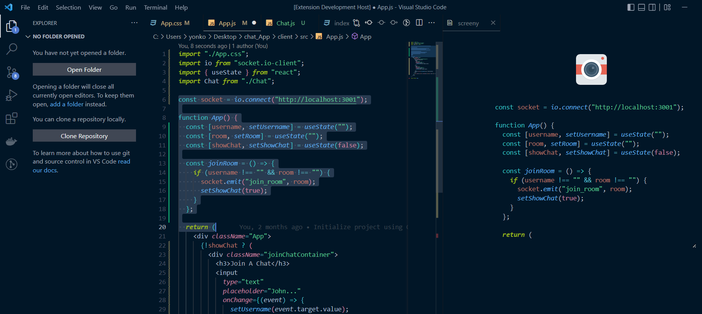
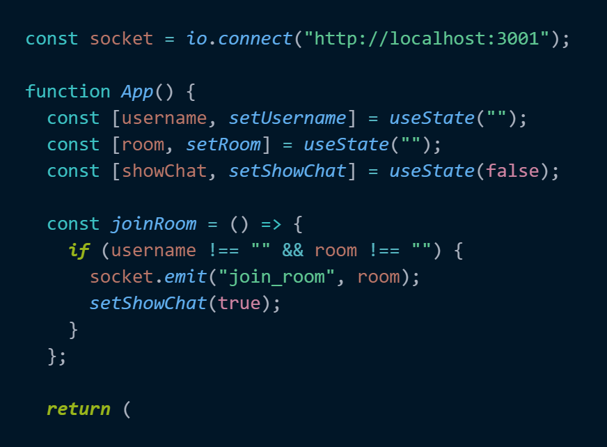

## Screeny

A vscode extension that allows you to take code screenshots.

## Instructions

1. Open the command palette (Ctrl+Shift+P on Windows) and type `screeny`.
2. Select the code you'd like to screenshot.
3. you can re-select to update desired code.
4. Click the top icon (the camera icon) to take the screenshot.

## Screenshot Examples

## Vscode theme used
[Sovereign Extension](https://marketplace.visualstudio.com/items?itemName=HoussemSlimani.sovereign&ssr=false#overview),
[Sovereign Github](https://github.com/Slimaniiiii/Sovereign)
